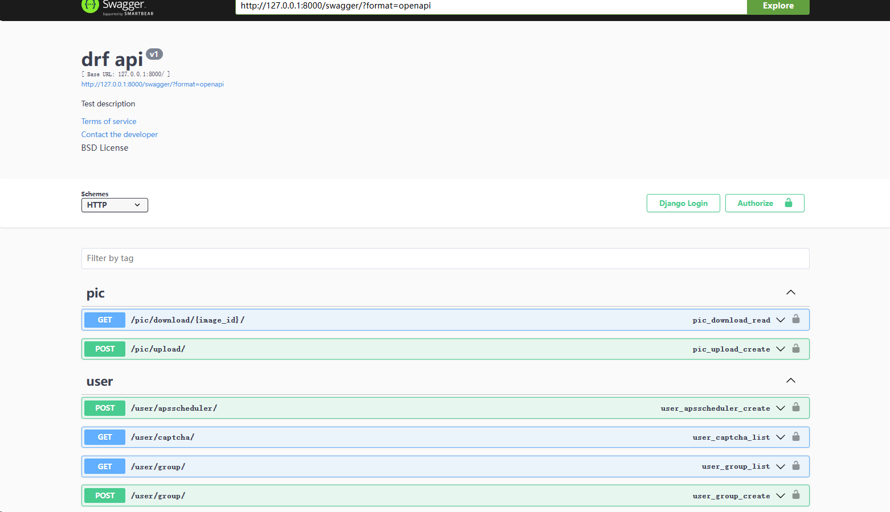
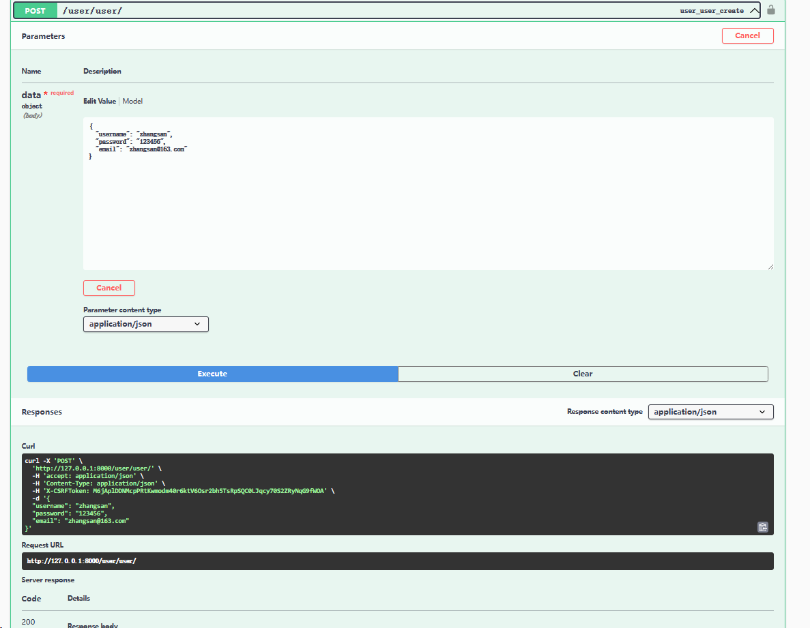
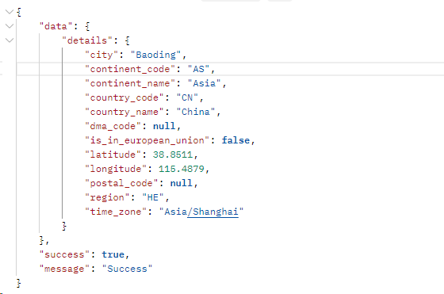

# DRF

#### 介绍

前后端分离项目，后端使用django+drf框架，前端使用layui框架.
自学layui框架，项目持续更新中...
#### 后端
    1.使用django，drf框架
    2.功能模块:
        a 用户:增删改查查crud
        b 分组:增删改查查crud
        c 登录，登出，修改密码，初始化密码
        d ...
        e ...
    3.定时任务:django_celery_beat实现
    4.Authentication权限验证,使用pyjwt模块生成Token
    5.version 版本控制
    6.pagination分页
    7.blinker 记录登录用户日志
    8.django-simple-captcha实现图片验证码
    9.pypinyin实现汉字转拼音，例如:张三 >>>  zhangsan
    10.APScheduler实现定时任务
    11.celery实现定时任务
    12.drf-yasg实现接口文档
    13.geoip2实现IP地址定位

#### 前端
    1.使用layui框架
    

#### 软件架构

软件架构说明

#### 安装教程

1. clone 项目到本地 git clone https://gitee.com/joyamon/drf.git
2. 创建虚拟环境 python -m venv venv
3. 激活虚拟环境 linux:source venv/bin/activate | windows:venv\scripts\activate
4. 安装依赖 pip install -r requirements.txt
5. 迁移数据库 python manage.py makemigrations
6. 同步数据库 python manage.py migrate
7. 运行项目 python manage.py runserver
8. 启动redis服务
9. 启动celery服务
   * 启动worker服务:celery -A  drfcelery.main worker --loglevel=info -P eventlet --pool=solo >logs/celeryworker.log
   * 启动beat服务:celery -A  drfcelery.main beat --loglevel=info >logs/celerybeat.log

#### 参与贡献

1. Fork 本仓库
2. 新建 Feat_xxx 分支
3. 提交代码
4. 新建 Pull Request

#### swagger集成效果图

#### geoip2获取IP地址信息

#### 特技

1. 使用 Readme\_XXX.md 来支持不同的语言，例如 Readme\_en.md, Readme\_zh.md
2. Gitee 官方博客 [blog.gitee.com](https://blog.gitee.com)
3. 你可以 [https://gitee.com/explore](https://gitee.com/explore) 这个地址来了解 Gitee 上的优秀开源项目
4. [GVP](https://gitee.com/gvp) 全称是 Gitee 最有价值开源项目，是综合评定出的优秀开源项目
5. Gitee 官方提供的使用手册 [https://gitee.com/help](https://gitee.com/help)
6. Gitee 封面人物是一档用来展示 Gitee 会员风采的栏目 [https://gitee.com/gitee-stars/](https://gitee.com/gitee-stars/)

#### 添加讨论
